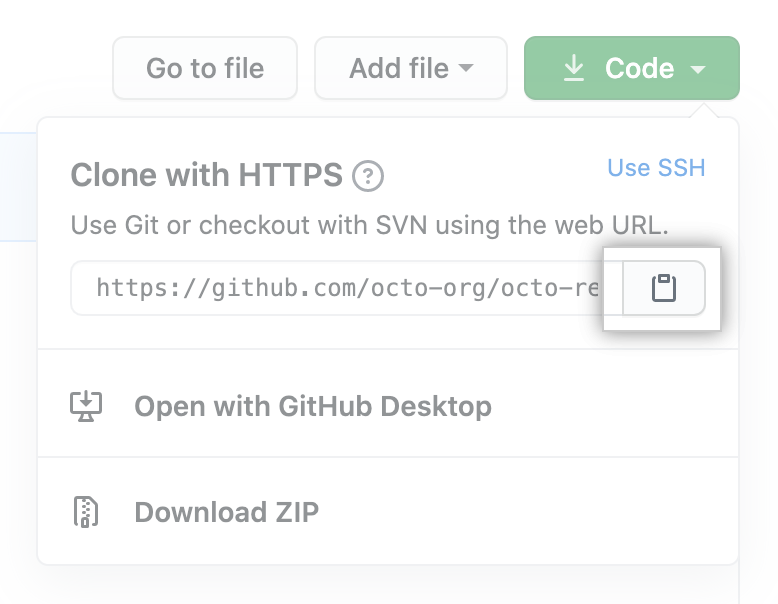
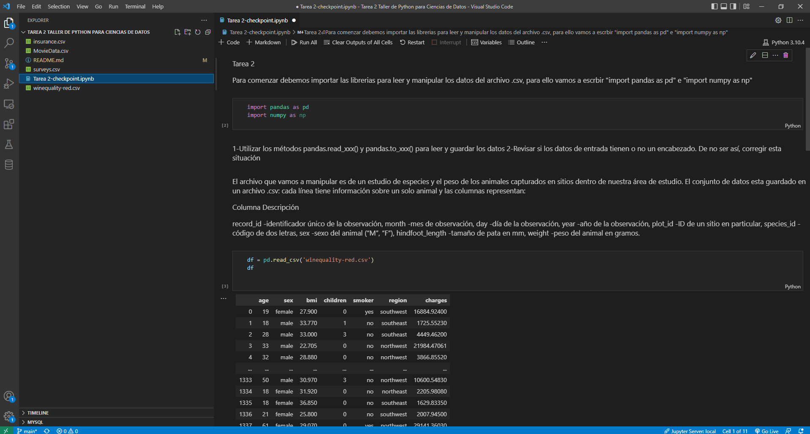

# Tarea 2

En esta tarea aplicaremos conceptos básicos de python, para leer, limpiar, normalizar valores, etc., utilizando herramientas visto en las clases de Taller de Python para Ciencias de Datos.

Para comenzar debemos clonar la carpeta con todos los archivos, para Linux (Lubuntu) lo haremos de la siguiente forma:

1. En GitHub.com, visitamos la página principal del repositorio.
2. Sobre la lista de archivos, damos clic en Código.

3. Para clonar el repositorio utilizando HTTPS, debajo de "Clonar con HTTPS", hacemos clic en el portapapel. 

4. Abrimos la Git Bash.
5. Cambiamos el directorio de trabajo actual a la ubicación en donde queremos clonar el directorio.
6. Escribimos ```git clone```, y luego pegamos la URL que copiamos anteriormente
```
$ git clone https://github.com/cfierrom/Tarea-2-Taller-de-Python-para-Ciencias-de-Datos
```
7. Por último, presionamos Enter para crear el clon local. 
``` 
$ git clone https://github.com/cfierrom/Tarea-2-Taller-de-Python-para-Ciencias-de-Datos
> Cloning into `Spoon-Knife`...
> remote: Counting objects: 10, done.
> remote: Compressing objects: 100% (8/8), done.
> remove: Total 10 (delta 1), reused 10 (delta 1)
> Unpacking objects: 100% (10/10), done.
```

## Abriendo el archivo

Luego que ya hemos clonado el repositorio, en la terminal ubicamos la carpeta del repositorio y escribimos ```code .``` y se abrirá la carpeta en el Visual Studio Code, donde encontraremos detallado los pasos a seguir:
```
$ nombre_carpeta/code .
```


